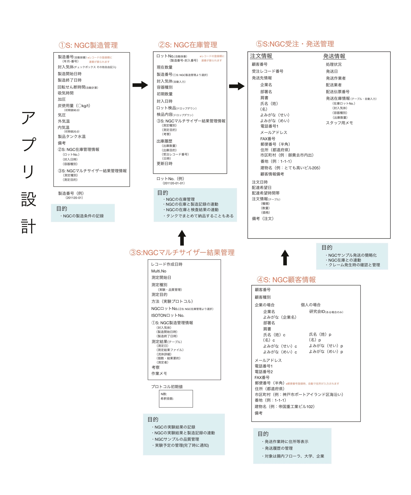
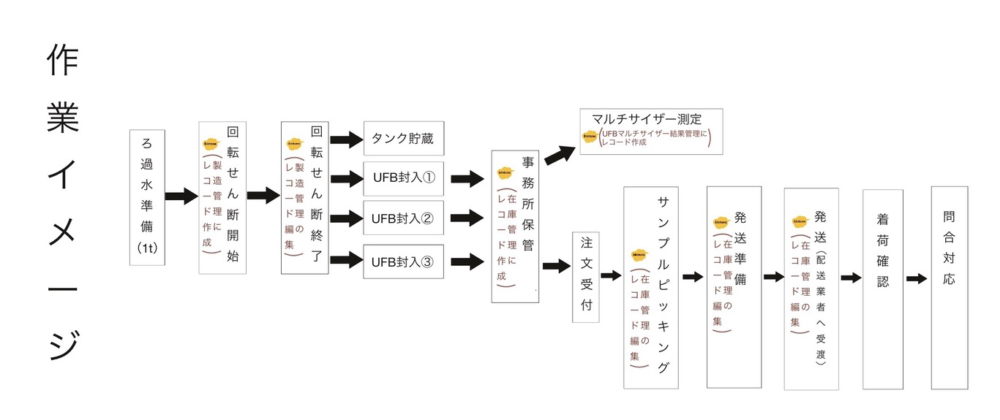
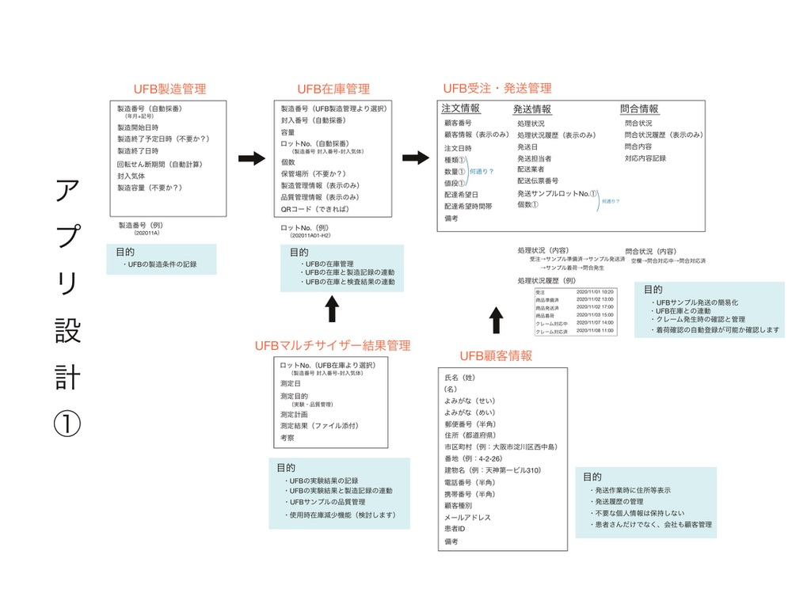
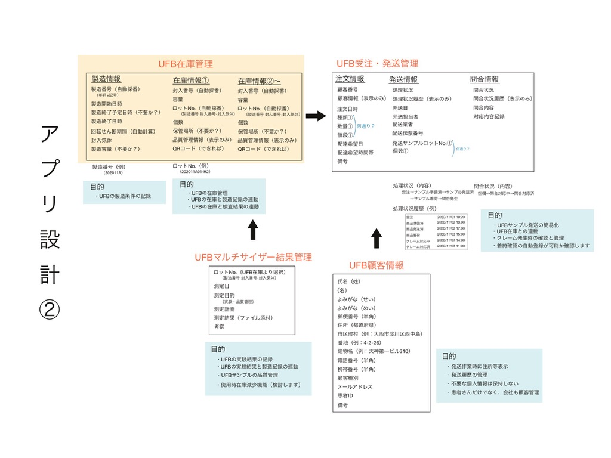
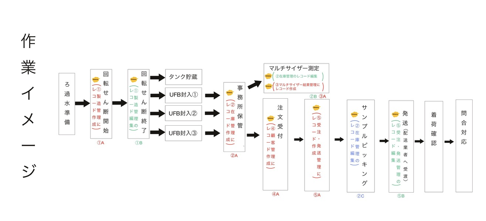

# シンバイオシス株式会社　kintoneアプリ制作概要

## アプリケーション概要

シンバイオシス株式会社（以降、会社）では、NGC水の製造、販売を行っています。  
その製造管理、在庫管理、検査結果管理、顧客情報管理、受注発送管理を行うことを目的に、データベース管理アプリkintoneを利用し、作成を行ないました。  

作業内容は以下の通りです。
- 要件定義（簡易）
- データベース（アプリ）設計
- JavaScriptによる機能拡張
- 簡易入力マニュアルの作成
- アプリ概要のプレゼンテーション

## 実装した機能

下記「アプリ設計画像」記載の項目を入力、管理できるアプリケーション群を作成しました。  
また、標準機能では対応することのできない、以下の機能をJavaScriptを用いて実装しました。  

### ・製造番号の自動採番機能
「YYMMDD-01」・・・年月日に、製造順に応じた連番をつなげた製造番号を自動採番する機能です。  
（/NGC製造管理/ngcmanufacture_serial.js）

### ・ロットNo.の自動採番  
「YYMMDD-01-01」・・・製造番号に、封入した順番に応じた連番をつなげたロットNo.を自動採番する機能です。
（/NGC在庫管理/ngczaiko_lot_number.js）

### ・住所の自動入力機能
郵便番号の入力後、「郵便番号データ配信サービスzipcloud」のAPIを利用し、住所を自動入力する機能です。
（/NGC顧客管理/ngckokyaku_postalcode.js）

### ・⑤S: NGC受注・発送管理アプリでの発送製品情報の自動参照機能  
在庫を使用した際は、②S:NGC在庫管理アプリ内の出庫管理テーブルに入力をする運用ルールとしていますが、⑤S: NGC受注・発送管理アプリにその内容を表示することは、標準機能では実現不可能です。  
そのため、JavaScriptを用いて、②S:NGC在庫管理内の出庫履歴テーブルの情報を自動参照、表示する機能です。

## 業務の流れ

### 簡易の要件定義／データベース（アプリ）設計
まず、会社のkintone管理担当者より、口頭で要望のヒアリングを行いました。  
その後、以下の資料を作成し、実際にkintoneを使用する方々と完成イメージのすり合わせを行いました。  

### 簡易入力マニュアルの作成／アプリ概要のプレゼンテーション
会社のkintone管理担当者と協力の上、アプリの作成完了後、入力の簡易マニュアルとして「NGC在庫管理.pdf」と共に以下の資料を作成し、実際にkintoneを使用する方々へ、アプリの仕組みと使用方法の説明を行いました。

NGC在庫管理.pdfは実際のファイルをご参照ください

