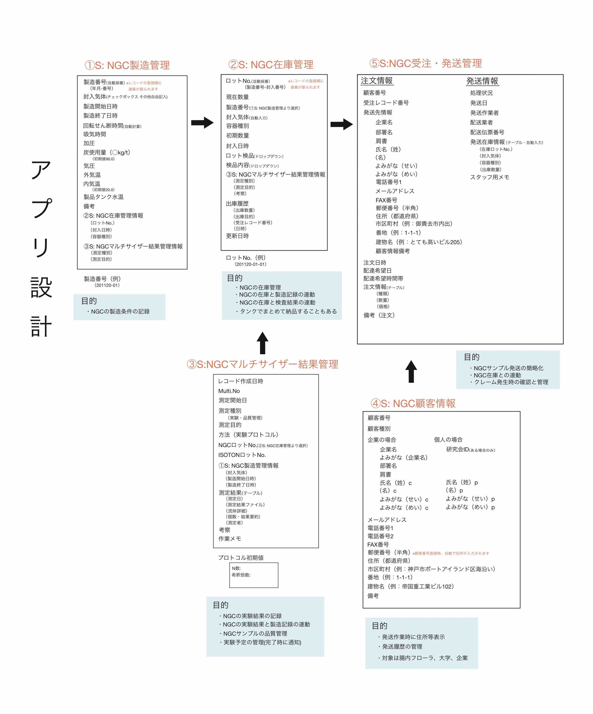
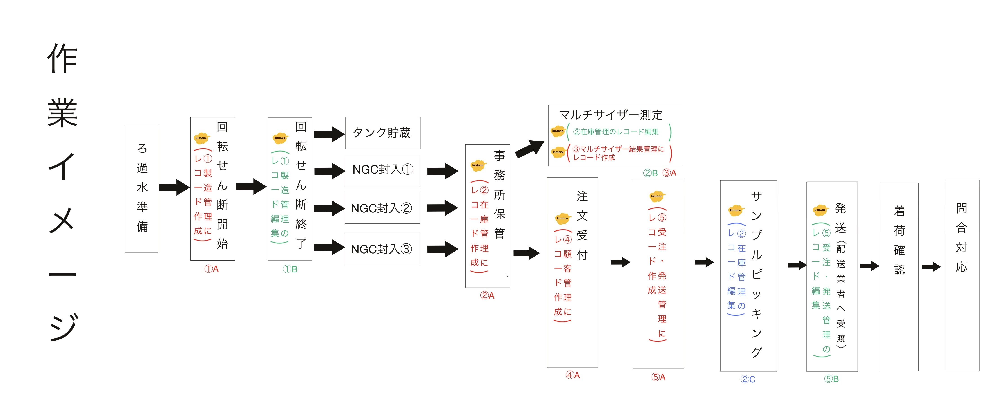

# シンバイオシス株式会社　kintoneアプリ制作概要

## アプリケーション概要

シンバイオシス株式会社（以降、会社）では、NGC水の製造、販売を行っています。  
その製造管理、在庫管理、検査結果管理、顧客情報管理、受注発送管理を行うことを目的に、データベース管理アプリkintoneを利用し、作成を行ないました。  

作業内容は以下の通りです。
- 要件定義（簡易）
- データベース（アプリ）設計
- JavaScriptによる機能拡張（セキュリティ上の懸念により断念）
- 簡易入力マニュアルの作成
- アプリ概要のプレゼンテーション

## 実装した機能

下記「アプリ設計画像」記載の項目を入力、管理できるアプリケーション群を作成しました。また、「製造番号」および「ロットNo.」に連番をつけるためのプラグインの導入を行いました。

## 業務の流れ

### 簡易の要件定義／データベース（アプリ）設計
まず、会社のkintone管理担当者より、口頭で要望のヒアリングを行いました。  
その後、以下の資料を作成し、実際にkintoneを使用する方々と完成イメージのすり合わせを行いました。  

### 簡易入力マニュアルの作成／アプリ概要のプレゼンテーション
会社のkintone管理担当者と協力の上、アプリの作成完了後、入力の簡易マニュアルとして「NGC在庫管理.pdf」と共に以下の資料を作成し、実際にkintoneを使用する方々へ、アプリの仕組みと使用方法の説明を行いました。

NGC在庫管理.pdfは実際のファイルをご参照ください

